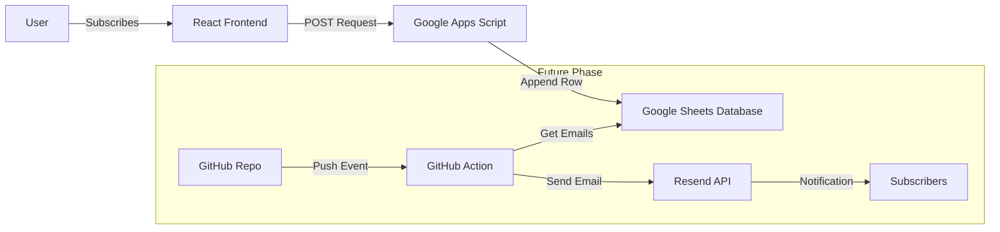

# CRASH Lab Mailing List Architecture

## 1. System Overview

This document outlines the technical architecture for the CRASH Lab mailing list system. The system is designed to operate within a serverless, static-site environment (GitHub Pages) while leveraging Google Workspace for backend data persistence and eventually GitHub Actions for email automation.

### High-Level Architecture


---

## 2. Phase 1: Subscription Collection (Current)

### 2.1 Backend: Google Apps Script (Wehook)
We utilize Google Apps Script (GAS) effectively as a serverless backend function ("Function as a Service") to bypass the need for a dedicated node server.

**Endpoint:** `https://script.google.com/macros/s/[DEPLOYMENT_ID]/exec`
**Method:** `POST`
**Content-Type:** `text/plain` (To avoid CORS preflight issues typical with `application/json` in GAS)

#### Script Logic (`Code.gs`)
```javascript
function doPost(e) {
  const lock = LockService.getScriptLock();
  lock.tryLock(10000); // Prevent concurrent write race conditions

  try {
    const sheet = SpreadsheetApp.getActiveSpreadsheet().getActiveSheet();
    const data = JSON.parse(e.postData.contents);
    const email = data.email;
    
    // Basic Validation
    if (!email || !email.includes('@')) {
      return ContentService.createTextOutput(JSON.stringify({
        "result": "error", 
        "message": "Invalid email"
      })).setMimeType(ContentService.MimeType.JSON);
    }

    // Check for duplicates (Simple scan)
    const existingEmails = sheet.getRange("B:B").getValues().flat();
    if (existingEmails.includes(email)) {
       return ContentService.createTextOutput(JSON.stringify({
        "result": "success", 
        "message": "Already subscribed"
      })).setMimeType(ContentService.MimeType.JSON);
    }

    const timestamp = new Date();
    sheet.appendRow([timestamp, email]);
    
    return ContentService.createTextOutput(JSON.stringify({
      "result": "success", 
      "message": "Subscribed"
    })).setMimeType(ContentService.MimeType.JSON);

  } catch (e) {
    return ContentService.createTextOutput(JSON.stringify({
      "result": "error", 
      "error": e.toString()
    })).setMimeType(ContentService.MimeType.JSON);
  } finally {
    lock.releaseLock();
  }
}
```

### 2.2 Database: Google Sheets
**Schema:**
| Column | Name | Type | Description |
| :--- | :--- | :--- | :--- |
| A | Timestamp | Date | Date/Time of subscription |
| B | Email | String | Subscriber email address |

### 2.3 Frontend: React Component (`Newsletter.tsx`)
**Location:** `src/components/Newsletter.tsx`

**State Machine:**
- `IDLE`: Form is visible, input is enabled.
- `LOADING`: API request in progress (spinner shown).
- `SUCCESS`: "Thank you" message shown.
- `ERROR`: Error message shown (e.g., "Something went wrong").

**CORS Handling:**
Google Apps Script redirects requests. Fetch API with `redirect: "follow"` and `mode: "no-cors"` is often suggested, BUT `no-cors` returns an opaque response (we can't read success/fail).
*Solution:* We will use standard `cors` mode. The GAS script must return valid headers. *Correction:* GAS Web Apps handle CORS automatically if we output pure JSON/Text. However, React often sends an `OPTIONS` flight which GAS doesn't handle well.
*Workaround:* Send data as `application/x-www-form-urlencoded` or `text/plain` to skip preflight, and parse it manually in the script.

---

## 3. Phase 2: Automation (Future Roadmap)

### 3.1 Trigger: GitHub Actions
We will create a workflow `.github/workflows/notify_subscribers.yml`.

**Trigger Condition:**
```yaml
on:
  push:
    paths:
      - 'src/data/blogPosts.ts'
    branches:
      - main
```

### 3.2 Change Detection Logic
A script `scripts/check_new_post.js` will run in the CI environment:
1.  Read the `src/data/blogPosts.ts` file.
2.  Extract the first item (latest post).
3.  Check a stored "state" file (e.g., `last_sent_post_id.txt` committed to the repo) OR compare with the previous commit diff.
4.  If the ID is different, proceed to send.

### 3.3 Email Delivery: Resend API
We will use [Resend](https://resend.com) for high deliverability.

**Environment Variables Required in GitHub Secrets:**
- `RESEND_API_KEY`: API key for sending emails.
- `GOOGLE_SCRIPT_URL`: To fetch the list of emails (Yes, we can reuse the GAS script with a `doGet` function to return the list, protected by a shared secret).

**Email Template:**
- **Subject:** `[New Post] {post.title}`
- **Body:** Simple HTML template including the `featuredImage`, `tldr`, and a link to the site.

---

## 4. Implementation Checklist

- [ ] **Deployment**: User creates Google Sheet & Deploys Script.
- [ ] **Frontend**: Implement `Newsletter.tsx`.
- [ ] **Integration**: Connect Frontend to Script URL.
- [ ] **Testing**: Verify data persistence.
- [ ] **Documentation**: Update `README.md` with instructions on how to maintain the mailing list.
